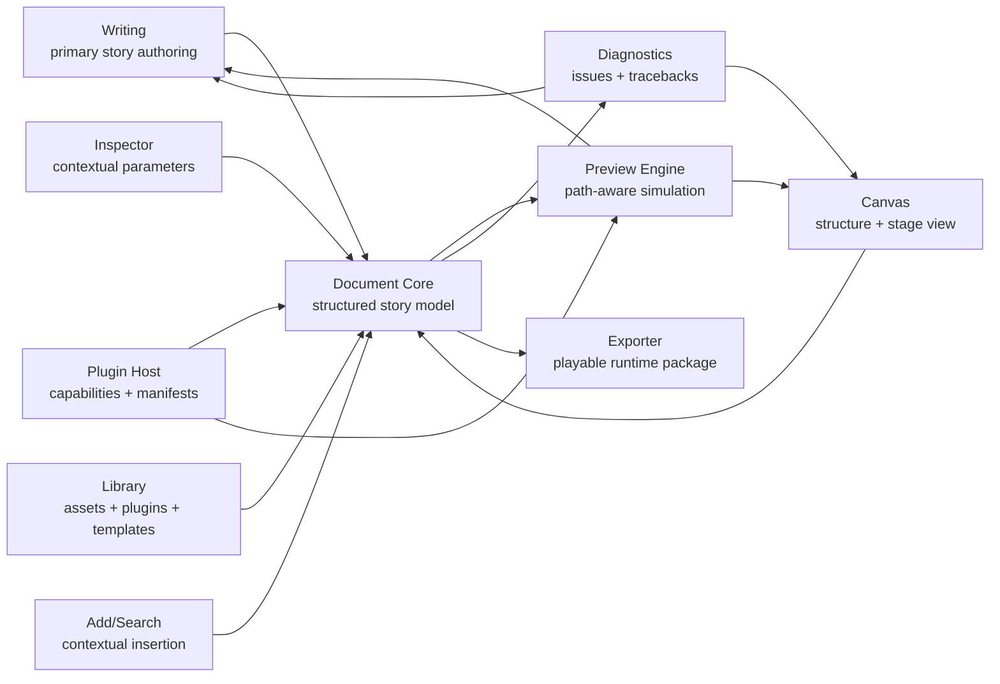

# Taro Architecture

Last updated: 2026-05-15

## Architecture Goal

Taro's architecture must preserve a readable story flow while supporting visual editing, path-aware preview, plugin capabilities, diagnostics, and export.

The central architectural rule is simple:

> One structured Document owns the work. Every surface edits or derives from that Document.

## System Overview

## Primary Modules

### Document Core

Owns the structured work:

- Project metadata
- Story flow
- Groups
- Content items
- Positions and references
- Records
- Conditions
- Stage changes
- Display modes
- Interactions
- Result actions
- Plugin capability instances
- Resource references

Document Core is the only module allowed to commit persistent project changes.

### Writing Surface

Writing presents the story flow as the primary creative surface.

Responsibilities:

- Insert, edit, split, merge, reorder, and delete Groups.
- Edit text and visible content items.
- Insert choices, conditions, records, jumps, waits, effects, and stage changes.
- Invoke a global add/search box that turns explicit creator choices into Document commands.
- Keep prose safe from accidental command interpretation.
- Maintain local selection and editing state without becoming the model owner.

### Canvas Surface

Canvas presents the Document visually.

Responsibilities:

- Show structure at broad zoom.
- Show path context and current route.
- Show the current Group and stage at close zoom.
- Edit stage objects and interaction regions when those edits map back to Document items.
- Diagnose multi-path stage differences.
- Navigate back to Writing positions.

Canvas must not persist hidden graph-only objects.

### Inspector

Inspector edits parameters for the current selection.

Responsibilities:

- Show parameter source: project default, display-mode default, plugin default, or local value.
- Edit selected content, Group, action, condition, record, resource, or plugin capability.
- Avoid becoming a disconnected form editor. Every Inspector edit needs a source item.

### Preview Engine

Preview simulates the runtime from a selected context.

Responsibilities:

- Render a Group with path-derived stage state.
- Run from a position with a selected path context.
- Run along a full path from initial state.
- Show current records and stage state.
- Emit tracebacks for choices, conditions, jumps, missing resources, plugin errors, and action bindings.

Preview state must not silently mutate the authoring Document.

Preview and Export should share one Player Runtime semantics layer for Group execution, click progression, records, jumps, stage state, and display modes. Preview may add editor-only overlays and diagnostics.

### Plugin Host

Plugin Host loads declared capabilities.

Responsibilities:

- Register display modes, interactions, effects, templates, editor tools, and runtime renderers.
- Validate plugin manifests and permissions.
- Expose trigger results and recommended actions.
- Require critical story-flow effects to expand into visible Taro bindings.
- Provide missing-plugin, upgrade, migration, and export diagnostics.

### Exporter

Exporter packages the work into a playable runtime.

Responsibilities:

- Validate Document contracts.
- Include required resources and plugin runtimes.
- Preserve Preview behavior in runtime.
- Report all blocking export issues with source locations.

The MVP Exporter only needs to produce a minimal local playable package for the ordinary VN dialogue loop. Broader plugin packaging and distribution workflows are later scope.

## Source Of Truth Boundaries

### Persistent Source

The persistent source is the Document.

All durable edits must be represented as Document changes.

### Derived Views

These are derived from the Document:

- Canvas graph layout
- Canvas stage render
- Preview state
- Diagnostics
- Export build graph
- Search index

Derived views can cache data, but they must be rebuildable.

### Local UI State

These states are local and not story truth:

- Selection
- Focus
- Hover
- Scroll
- Zoom
- Open panels
- Temporary preview playback state

Local UI state may be saved as editor preference, but it must not affect story meaning.

Selection sync between Writing, Canvas, Inspector, and Preview is local UI/editor state. It should use editor events or commands, not Document mutation commands.

## Data Flow

1. A user action starts in Writing, Canvas, Inspector, Library, or Preview.
2. If the action changes story truth, the surface creates an explicit Document command.
3. If the action only changes selection, focus, zoom, panels, or Preview playback, it updates editor or Preview state.
4. Document Core validates Document commands against product invariants.
5. Document Core applies a patch.
6. Derived views update from the changed Document.
7. Diagnostics recompute affected checks.
8. Preview and Export use the same resulting Document semantics.

## Invariants

- Every jump target resolves to a stable position or named structural target.
- Every condition references defined records or plugin-declared read values.
- Every record write uses a defined record key and compatible value.
- Every plugin-provided trigger result is bound to visible Taro actions before it controls story flow.
- Every Canvas structural connection maps to a choice option, condition branch, jump, or interaction result action.
- Every stage render at a story position has a path context.
- Every branch merge with conflicting stage state is either resolved or explicitly accepted.
- Every export build uses the same action and state semantics as Preview.

## Error Strategy

Errors should be source-locatable.

Each blocking issue needs:

- A stable issue code.
- Human-readable message.
- Source position or resource reference.
- Affected surface.
- Suggested fix.
- Export blocking level.

## Architecture Non-Goals

- Do not introduce a second graph model that can diverge from Writing.
- Do not make plugins the owners of hidden branching logic.
- Do not make Preview the persistence layer.
- Do not make line numbers the durable identity system.
- Do not require ordinary creators to understand renderer or SDK internals.
